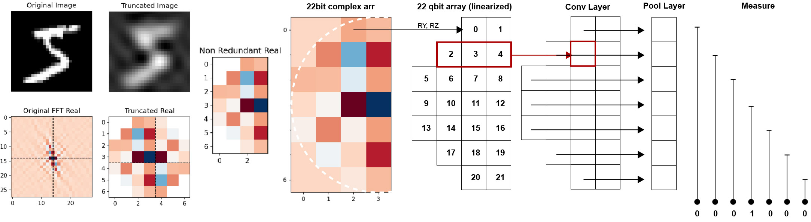

# Quantum MNIST


Quantum MNIST is an open-source project aiming to  produce a workflow to train a **Quantum Neural Network (QNN)** for the **full MNIST dataset** for complete digit classification (0–9) based on Qiskit and Qiskit Machine Learning.  
To our knowledge, no quantum neural network has  achieved a full MNIST 0-9 digit classification — this repository documents our approach, experiments, and workflow toward that milestone.



## 🌟 Overview

1. **Fourier-based preprocessing**  
   Each MNIST image is transformed using a Fast Fourier Transform (FFT), separating real and imaginary components.

2. **Hermitian symmetry reduction**  
   The Hermitian symmetry inherent in the FFT images is explicitly removed, cutting redundancy and halving qubit usage.

3. **Radial subsampling**  
   Only central frequency components are retained, discarding peripheral values with low information content. The resulting radial mask yields **22 significant frequency positions**.

4. **Complex encoding in qubits**  
   Both real and imaginary parts of each retained coefficient are embedded into the same qubit using dual-rotation encoding (Y, Z).

5. **Custom convolution–pooling ansatz**  
   A generalized *n→1 pooling* scheme replaces standard pooling. This reduces circuit depth while maintaining expressivity, enabling training under realistic resource constraints.

## 📂 Repository Structure

```
quantum_mnist/
│
├── quantum_mnist_training.ipynb  # Main exploratory notebook
│
├── train.py                      # Standalone training script
│
├── generate_dataset.py           # Dataset generation utility
│
├── LICENSE                       # MIT license
└── README.md                     # This file
```

## 📓 Notebook

To understand better the rationale behind this training/inference workflow, please follow the Jupyter Notebook [quantum_mnist_training.ipnyb](https://github.com/ljcamargo/quantum_mnist/blob/master/quantum_mnist_training.ipynb)

## ⚙️ Scripts

### 1. Training

For serious use beyond the notebook, use the standalone training script:

```bash
python train.py
```

Currently, **all hyperparameters and settings are hardcoded**. Future releases will include configurable options.

---

### 2. Dataset Generation

Generates Fourier-transformed and subsampled MNIST datasets. This script produced the dataset available on Huggingface [ljcamargo/quantum_mnist](https://huggingface.co/datasets/ljcamargo/quantum_mnist)

```bash
Usage: python generate_dataset.py <input_path> <output_dir> [--truncate-factor 0.3] [--split train]
```

- `<input_path>`: Path to raw MNIST data.  
- `<output_dir>`: Directory to save processed dataset.  
- `--truncate-factor`: (optional) controls subsampling. Default = `0.3`.  
- `--split`: (optional) dataset split (`train` or `test`).  

Example:

```bash
python generate_dataset.py ./mnist_raw ./data --truncate-factor 0.25 --split train
```

## 📦 Requirements

To run this project you will need:

- Python 3.9+
- [Qiskit 2.0](https://qiskit.org/) (qiskit, qiskit-machine-learning)
- NumPy
- Matplotlib
- scikit-learn
- Datasets (Hugging Face `datasets` library)

You can install them via:

```bash
pip install qiskit qiskit-machine-learning numpy matplotlib scikit-learn datasets
```

## 📊 Training Status

**Training using the full MNIST dataset is ongoing and under active experimentation. Results will be shared soon.**

---

## 📜 License

This project is licensed under the [MIT License](./LICENSE).  

Author: **Luis J Camargo-Pérez**
